 

<table align="center" border="0">
<tr>
<td width="38%" align="center" valign="middle">

</td>
<td width="62%" valign="middle">

### 🧠 About Me

AI & Data Science developer interested in building practical applications using **Machine Learning, Generative AI, RAG, LLMs and Web Technologies.**

- 🔭 Currently working on **RAG-based intelligent retrieval systems**
- 🌱 Deepening my skills in **AI Agents & LLM-powered applications**
- ⚙️ Comfortable across the full stack: data → model → deployable app
- 💬 Ask me about **ML pipelines, embeddings, and RAG architectures**

</td>
</tr>
</table>

---

### 🛠️ Tech Arsenal

<table width="100%">
<tr>
<td width="33%" valign="top" align="center">

**Languages**

 
 
 

</td>
<td width="34%" valign="top" align="center">

**AI / Data**

 
 
 
 
 
 

</td>
<td width="33%" valign="top" align="center">

**Web / Backend / Tools**

 
 
 
 
 

</td>
</tr>
</table>

---

### 🚀 Featured Projects

**🔎 AI Lecture Retrieval System**
RAG-based AI system that finds where a topic is discussed inside course lectures.
`Whisper` `FFmpeg` `BGE-M3` `RAG` `Ollama` `LLM`
Pipeline: `Course Videos → Audio Processing → Whisper Transcription → Chunks → BGE-M3 Embeddings → Semantic Retrieval → RAG → LLM Answer → Video + Timestamp`

**📄 AI Interview & Resume Coach**
AI-powered platform for resume analysis and interview preparation.
`PDF` `ATS` `RAG` `LLM` `AI Agents`
Features: Resume Analysis · ATS Score · RAG Chat · Interview Preparation

**📊 Machine Learning Projects**
Hands-on machine learning projects involving preprocessing, feature engineering, regression, classification, evaluation and data analysis.
`Python` `Scikit-Learn` `Pandas` `NumPy`

---

### 📈 GitHub Stats

  

  

  

> `stats.svg`, `langs.svg` and `trophies.svg` are generated from your real GitHub data by the `update-stats.yml` Action (repos, stars, followers — no invented numbers) and refresh automatically every day. The streak card above is still a live third-party widget since streak data needs GitHub's contribution graph.

---

### 🐍 Contribution Snake

> Needs the `snake.yml` GitHub Action (given earlier) run at least once to exist.

---

### ⚡ Currently Building

---

### 💭 Developer Philosophy

**BUILD. BREAK. LEARN. IMPROVE.**

---

### 📫 Let's Connect

**HS-AI-001 • BUILDING • LEARNING**

Thanks for visiting my profile. 🚀

